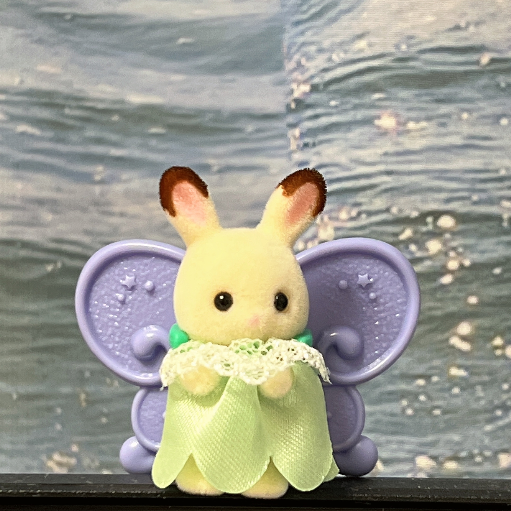
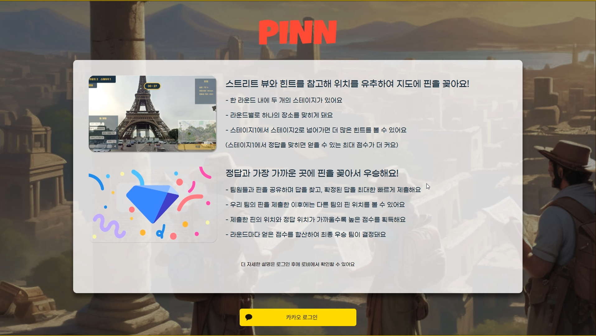
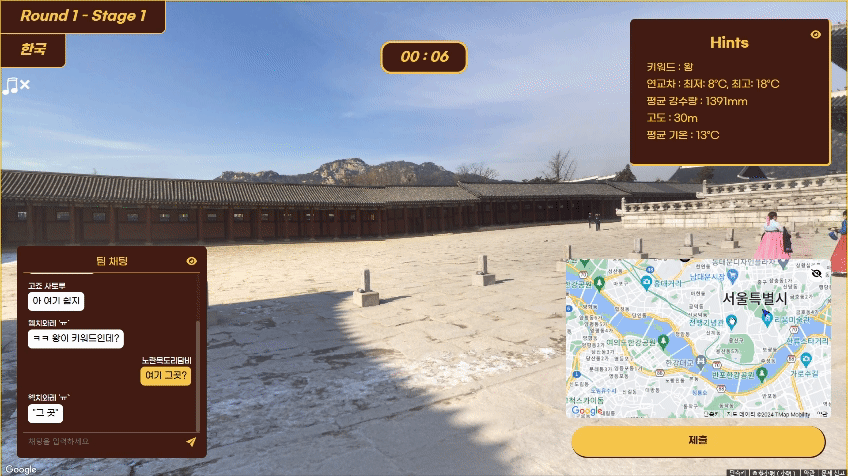
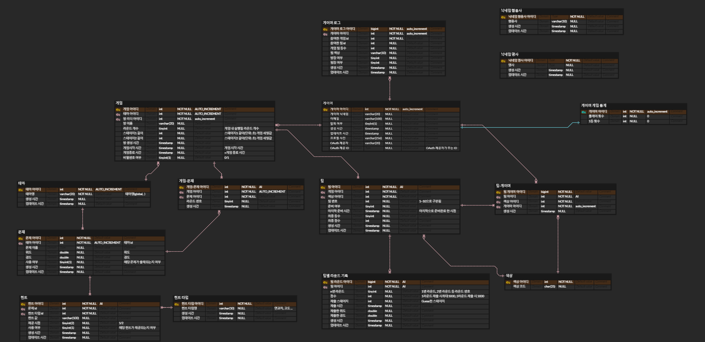

# 🌎 PINN 📍

- 전 세계의 다양한 장소를 배경으로 즐기는, Google StreetView 기반 온라인 위치 추측 게임! **"PINN"**
- ‘랜덤’, ‘한국’, ‘그리스’, ‘이집트’, ‘랜드마크’의 5가지 테마 중 하나를 선택해 플레이할 수 있습니다.
- 각 게임은 여러 개의 라운드로 구성되고, 하나의 라운드는 2개의 스테이지로 구분됩니다.
- 팀원들과 핀을 공유하며, 스트릿 뷰와 힌트를 바탕으로 정답 위치를 추측하세요.
- 각 라운드의 점수를 종합하여 최종 순위가 결정됩니다.
- 최종 1위 팀이 되어, 숨겨진 보물을 차지하세요.

## 목차

- [개발 기간](#개발-기간)
- [팀원](#팀원)
- [기술 스택](#기술-스택)
- [서비스 화면 예시](#서비스-화면-예시)
- [아키텍처 다이어그램](#아키텍처-다이어그램)
- [ERD](#erd)
- [디렉토리 구조](#디렉토리-구조)

## 개발 기간

2024.05.01 ~ 2024.05.20 (6주)

## 팀원

<table>
  <tr>
         <td align="center" width="16%">
            <a href="https://github.com/neongseoman"></a>
            <br />
            <a href="https://github.com/neongseoman">박근수</a>
        </td>
        <td align="center" width="16%">
            <a href="https://github.com/dynene"></a>
            <br />
            <a href="https://github.com/dynene">김다인</a>
        </td>
        <td align="center" width="16%">
            <a href="https://github.com/kseenyoung"></a>
            <br />
            <a href="https://github.com/kseenyoung">김신영</a>
        </td>
        <td align="center" width="16%">
            <a href="https://github.com/gimjiyong"></a>
            <br />
            <a href="https://github.com/gimjiyong">김지용</a>
        </td>
        <td align="center" width="16%">
            <a href="https://github.com/sje08250"></a>
            <br />
            <a href="https://github.com/sje08250">손지은</a>
        </td>
        <td align="center" width="16%">
            <a href="https://github.com/JDomynic"></a>
            <br />
            <a href="https://github.com/JDomynic">진창현</a>
        </td>
      <tr>
        <td align="center">    
          <div><b>팀장, 백엔드</b></div>
          <div>비동기 스케줄링, MongoDB 설정</div>
          <div>OAuth 및 시큐리티</div>
        </td>
        </td>
        <td align="center">
            <div><b>백엔드, 인프라</b></div>
            <div>Nginx, Grafana, Prometheus 설정</div>
            <div>인게임 진행 로직, Game 관련 API</div>
        </td>
		<td align="center">
            <div><b>백엔드, 인프라</b></div>
            <div>Jenkins를 활용한 CI/CD</div>
            <div>Room, Lobby 서버 담당</div>
        </td>
        <td align="center">
            <div><b>프론트엔드 팀장</b></div>
          <div>Google Map API</div>
          <div>STOMP.js 기반 소켓 연결</div>
        </td>
        <td align="center">
            <div><b>프론트엔드</b></div>
          <div>Landing page</div>
          <div>Lobby page</div>
		  <div>OAuth Login</div>
        </td>
        <td align="center">
          <div><b>프론트엔드</b></div>
          <div><b>Room, Result page</b></div>
          <div>Google Map API 커스텀</div>
          <div>STOMP.js 기반 소켓 연결</div>
        </td>
      </tr>
  </tr>
</table>

## 기술 스택

### Front-end

<div>


</div>

### Back-end

<div>


</div>

### Infra

<div>


</div>

### 협업Tools

<div>


</div>

<br />

## 서비스 화면 예시

PINN 서비스의 각 화면에 대한 자세한 설명.

### 랜딩 페이지

프로젝트 소개와 로그인을 수행할 수 있는 페이지입니다.



### 로비

**설명:**
로비 화면에서는 사용자가 게임 수행을 위한 다양한 기능을 수행할 수 있습니다.

**주요 기능:**

- 게임(방) 생성 하기
  
- 게임 입장하기
- 닉네임 바꾸기
- 빠른 시작
- 들어갈 수 있는 게임 목록 불러오기

**사용 예시:**

- 사용자는 로그인 후 로비 화면에서 입장 가능한 방 목록을 확인하거나 방을 새롭게 만듭니다.
- '빠른 시작' 버튼을 통해 빠르게 시작할 수 있는 공개 방으로 이동합니다.
- 회원가입 시 랜덤으로 생성된 닉네임을 변경합니다.

### 대기방

게임 시작을 위해 참가자들과 채팅하거나 팀을 옮기며 기다리는 공간.


**설명:**

- 모든 팀이 준비되면, 방장이 게임을 시작할 수 있습니다.
- 방장은 언제든 게임의 테마, 라운드 수, 스테이지1 시간, 스테이지2 시간을 변경할 수 있습니다.
- 게임 시작 전까지, 게임의 구성원들과 채팅으로 이야기를 나눠 보세요.
- 다른 팀 영역을 클릭하여, 소속 팀을 옮길 수 있습니다.
  - `준비 완료` 팀에 인원 변동이 생기는 경우, 팀은 `준비중` 상태로 돌아가게 됩니다.
  - `준비 완료` 상태인 팀으로는 이동할 수 없습니다.
  - 한 팀 당 최대 인원은 3명입니다.
- 나가기 버튼을 통해, 로비로 돌아갈 수 있습니다.

**주요 기능:**

- 게임 시작
- 팀 준비 완료
- 참가자들과 채팅
- 팀 옮기기
- 게임 옵션(테마, 스테이지1/2 시간) 변경하기

### 인게임



**설명:**

- 테마에 따라 인게임 색상 테마도 함께 달라집니다. 테마의 분위기에 맞게 플레이해 보세요.
- 왼쪽 상단에서 현재 라운드/현재 스테이지/테마 정보를 확인할 수 있습니다.
- 화면의 상단 중앙에 현재 스테이지의 남은 시간이 표시됩니다.
- 우측 상단에서, 현재 라운드의 정답과 관련된 힌트를 확인할 수 있습니다.
  - 스테이지2로 전환될 때, 힌트가 추가로 지급됩니다. 대신, 획득 가능한 최대 점수는 감소하게 됩니다.
- 좌측 하단의 채팅을 통해, 팀원들과 대화를 나누고 자신의 추측을 공유할 수 있습니다.
- 우측 하단의 지도에서, 클릭을 통해 팀원들과 협업하여 예측한 장소에 핀을 찍습니다.
  - 팀원들의 현재 마우스 커서 위치를 실시간으로 확인할 수 있습니다.
  - 하나의 팀은 하나의 핀을 공유합니다.
  - 예측을 마친 팀은 “제출” 버튼을 통해 현재 라운드의 최종 정답을 제출하게 됩니다.
- 각 요소별 오른쪽 상단에 위치한 👁 눈 모양 아이콘을 클릭하여, 해당 요소가 화면에 항상 표시되도록 설정할 수 있습니다.

**주요 기능:**

- 팀 멤버 간 핀 공유
- 팀 멤버 간 마우스 위치 공유

### 라운드 대기방


**설명:**

- 라운드의 정답을 최종 제출한 팀은 라운드 대기방으로 이동합니다.
- 다른 팀들이 최종 제출한 핀 정보와 함께, 아직 답을 제출하지 않은 팀의 핀 위치가 실시간으로 바뀌는 것을 지켜볼 수 있습니다.
- 팀원들과 채팅을 통해 대화를 나누며, 현재 라운드의 결과 발표를 기다리게 됩니다.

### 라운드 결과


**설명:**

- 스테이지 1과 스테이지 2에 할당된 시간이 모두 종료된 경우, 각 팀이 현재 라운드에서 획득한 점수와, 그를 바탕으로 한 팀별 순위가 공개됩니다.
- 정답 위치, 각 팀이 제출한 핀의 위치, 그 핀들이 정답으로부터 얼마나 떨어져 있는지를 확인할 수 있습니다.
- 한 눈에 알아보기 쉽도록, 사용자가 속한 팀은 노란색으로 강조되어 표시됩니다.

### 게임 결과


**설명:**

- 모든 라운드가 끝나면, 게임의 최종 결과가 공개됩니다.
- 자신이 속한 팀이 라운드 별로 제출한 핀들을 모아 볼 수 있습니다.
- 자신의 팀이 라운드 별로 획득한 점수를 확인할 수 있습니다.

- 각 팀의 라운드 별 점수를 합산한 총점을 바탕으로 한, 현재 게임의 최종 순위를 확인할 수 있습니다.
- 한 게임이 최종 종료되면, 해당 방은 자동으로 소멸됩니다.

## 아키텍처 다이어그램


## ERD



<details>
<summary>DDL</summary>
<div markdown="1">

```SQL
CREATE TABLE `gamer` (
	`gamer_id`	int	NOT NULL	DEFAULT auto_increment,
	`nickname`	varchar(20)	NULL,
	`email`	varchar(100)	NULL,
	`is_deleted`	tinyint(1)	NULL,
	`created_date`	timestamp	NULL,
	`updated_date`	timestamp	NULL,
	`image_url`	varchar(256)	NULL,
	`oauth_provider`	varchar(20)	NULL,
	`provider_id`	VARCHAR(255)	NULL	COMMENT 'OAuth 제공자가 주는 ID'
);

CREATE TABLE `game` (
	`game_id`	int	NOT NULL	DEFAULT AUTO_INCREMENT,
	`theme_id`	int	NOT NULL	DEFAULT AUTO_INCREMENT,
	`leader_id`	int	NOT NULL	DEFAULT auto_increment,
	`room_name`	varchar(20)	NULL,
	`round_count`	tinyint	NULL	COMMENT '게임 내 실행될 라운드 개수',
	`stage1_time`	int	NULL	COMMENT '스테이지1 길이(단위: 초) 게임 세팅값',
	`stage2_time`	int	NULL	COMMENT '스테이지2 길이(단위: 초) 게임 세팅값',
	`room_create_time`	timestamp	NULL,
	`started_time`	timestamp	NULL	COMMENT '게임 시작 시간',
	`finished_time`	timestamp	NULL	COMMENT '=게임 종료 시간',
	`has_password`	tinyint(1)	NULL	COMMENT '0/1'
);

CREATE TABLE `team` (
	`team_id`	int	NOT NULL	DEFAULT AI,
	`game_id`	int	NOT NULL,
	`color_id`	int	NOT NULL,
	`team_number`	int	NULL	COMMENT '1~10으로 구분됨',
	`is_ready`	tinyint	NULL,
	`last_ready_time`	timestamp	NULL	COMMENT '마지막으로 준비완료 한 시점',
	`final_rank`	tinyint	NULL,
	`final_score`	int	NULL,
	`created_date`	timestamp	NULL,
	`updated_date`	timestamp	NULL
);

CREATE TABLE `question` (
	`question_id`	int	NOT NULL,
	`theme_id`	int	NOT NULL	DEFAULT AUTO_INCREMENT	COMMENT '테마 id',
	`question_name`	VARCHAR(255)	NULL,
	`lat`	double	NULL	COMMENT '위도',
	`lng`	double	NULL	COMMENT '경도',
	`use_or_not`	tinyint(1)	NULL	COMMENT '해당 문제가 출제되는지 여부',
	`created_date`	timestamp	NULL,
	`updated_date`	timestamp	NULL
);

CREATE TABLE `theme` (
	`theme_id`	int	NOT NULL	DEFAULT AUTO_INCREMENT,
	`theme_name`	varchar(20)	NOT NULL	COMMENT '테마명(global,  )',
	`created_date`	timestamp	NULL,
	`updated_date`	timestamp	NULL
);

CREATE TABLE `gamer_log` (
	`gamer_log_id`	bigint	NOT NULL	DEFAULT auto_increment,
	`gamer_id`	int	NOT NULL	DEFAULT auto_increment,
	`game_id`	int	NOT NULL,
	`team_id`	int	NULL,
	`total_rank`	int	NULL,
	`team_color`	varchar(10)	NULL,
	`is_room_leader`	tinyint	NULL,
	`is_team_leader`	tinyint	NULL,
	`created_date`	timestamp	NULL,
	`updated_date`	timestamp	NULL
);

CREATE TABLE `team_round` (
	`team_round_id`	bigint	NOT NULL	DEFAULT AI,
	`team_id`	int	NOT NULL	DEFAULT AI,
	`round_number`	tinyint	NULL	COMMENT '1번 라운드, 2번 라운드 등 라운드 번호',
	`round_score`	int	NULL	COMMENT '1라운드 제출 시최대 5000, 2라운드 제출 시 3000',
	`submit_stage`	int	NULL	COMMENT 'Guess한 스테이지',
	`submit_time`	timestamp	NULL,
	`submit_lat`	double	NULL,
	`submit_lng`	double	NULL,
	`created_date`	timestamp	NULL,
	`updated_date`	timestamp	NULL
);

CREATE TABLE `hint` (
	`hint_id`	int	NOT NULL	DEFAULT AI,
	`question_id`	int	NOT NULL,
	`hint_type_id`	int	NOT NULL,
	`hint_value`	varchar(100)	NULL,
	`offer_stage`	tinyint(2)	NULL	COMMENT '1/2',
	`use_or_not`	tinyint(1)	NULL	COMMENT '해당 힌트가 제공되는지 여부',
	`created_date`	timestamp	NULL,
	`updated_date`	timestamp	NULL
);

CREATE TABLE `team-gamer` (
	`team_gamer_id`	bigint	NOT NULL,
	`team_id`	int	NOT NULL	DEFAULT AI,
	`color_id`	int	NOT NULL,
	`gamer_id`	int	NOT NULL	DEFAULT auto_increment,
	`created_date`	timestamp	NULL
);

CREATE TABLE `game-question` (
	`game_question_id`	int	NOT NULL	DEFAULT AI,
	`game_id`	int	NOT NULL	DEFAULT AUTO_INCREMENT,
	`question_id`	int	NOT NULL,
	`round_number`	tinyint	NULL,
	`created_date`	timestamp	NULL
);

CREATE TABLE `gamer_status` (
	`gamer_id`	int	NOT NULL	DEFAULT auto_increment,
	`play_count`	int	NULL	DEFAULT 0,
	`win_count`	int	NULL	DEFAULT 0
);

CREATE TABLE `hint_type` (
	`hint_type_id`	int	NOT NULL,
	`hint_type_name`	varchar(10)	NULL	COMMENT '연교차, 고도 ...',
	`created_date`	timestamp	NULL,
	`updated_time`	timestamp	NULL
);

CREATE TABLE `nickname_adjective` (
	`nickname_adjective_id`	VARCHAR(255)	NOT NULL,
	`adjective`	varchar(10)	NULL,
	`created_date`	timestamp	NULL,
	`updated_date`	timestamp	NULL
);

CREATE TABLE `nickname_noun` (
	`nickname_noun_id`	VARCHAR(255)	NOT NULL,
	`noun`	VARCHAR(255)	NULL,
	`created_date`	timestamp	NULL,
	`updated_date`	timestamp	NULL
);

CREATE TABLE `color` (
	`color_id`	int	NOT NULL,
	`color_code`	char(25)	NULL
);

ALTER TABLE `gamer` ADD CONSTRAINT `PK_GAMER` PRIMARY KEY (
	`gamer_id`
);

ALTER TABLE `game` ADD CONSTRAINT `PK_GAME` PRIMARY KEY (
	`game_id`
);

ALTER TABLE `team` ADD CONSTRAINT `PK_TEAM` PRIMARY KEY (
	`team_id`
);

ALTER TABLE `question` ADD CONSTRAINT `PK_QUESTION` PRIMARY KEY (
	`question_id`
);

ALTER TABLE `theme` ADD CONSTRAINT `PK_THEME` PRIMARY KEY (
	`theme_id`
);

ALTER TABLE `gamer_log` ADD CONSTRAINT `PK_GAMER_LOG` PRIMARY KEY (
	`gamer_log_id`
);

ALTER TABLE `team_round` ADD CONSTRAINT `PK_TEAM_ROUND` PRIMARY KEY (
	`team_round_id`
);

ALTER TABLE `hint` ADD CONSTRAINT `PK_HINT` PRIMARY KEY (
	`hint_id`
);

ALTER TABLE `team-gamer` ADD CONSTRAINT `PK_TEAM-GAMER` PRIMARY KEY (
	`team_gamer_id`
);

ALTER TABLE `game-question` ADD CONSTRAINT `PK_GAME-QUESTION` PRIMARY KEY (
	`game_question_id`
);

ALTER TABLE `gamer_status` ADD CONSTRAINT `PK_GAMER_STATUS` PRIMARY KEY (
	`gamer_id`
);

ALTER TABLE `hint_type` ADD CONSTRAINT `PK_HINT_TYPE` PRIMARY KEY (
	`hint_type_id`
);

ALTER TABLE `nickname_adjective` ADD CONSTRAINT `PK_NICKNAME_ADJECTIVE` PRIMARY KEY (
	`nickname_adjective_id`
);

ALTER TABLE `nickname_noun` ADD CONSTRAINT `PK_NICKNAME_NOUN` PRIMARY KEY (
	`nickname_noun_id`
);

ALTER TABLE `color` ADD CONSTRAINT `PK_COLOR` PRIMARY KEY (
	`color_id`
);

ALTER TABLE `gamer_status` ADD CONSTRAINT `FK_gamer_TO_gamer_status_1` FOREIGN KEY (
	`gamer_id`
)
REFERENCES `gamer` (
	`gamer_id`
);


```

</div>
</details>

## 디렉토리 구조

<details>
<summary><b>FE<b/></summary>
<div markdown="1">

```
frontend
├─ .env
├─ .eslintrc.json
├─ .gitignore
├─ .prettierrc
├─ Dockerfile
├─ next-env.d.ts
├─ next.config.mjs
├─ package-lock.json
├─ package.json
├─ public
│  └─ assets
│     ├─ fonts
│     ├─ images
│     │  ├─ lotties
│     │  ├─ svg
│     │  └─ themes
│     └─ sounds
├─ README.md
├─ src
│  ├─ app
│  │  ├─ (landing)
│  │  └─ (main)
│  │     ├─ game
│  │     │  └─ [gameId]
│  │     │     ├─ [round]
│  │     │     │  ├─ (ingame)
│  │     │     │  │  └─ _components
│  │     │     │  ├─ result
│  │     │     │  │  └─ _components
│  │     │     │  └─ waiting
│  │     │     │      └─ _components
│  │     │     └─ end
│  │     │        ├─ 1
│  │     │        │  └─ _components
│  │     │        └─ 2
│  │     ├─ lobby
│  │     │  └─ _components
│  │     ├─ login
│  │     └─ room
│  │        └─ [id]
│  │           └─ _components
│  ├─ components
│  ├─ stores
│  ├─ types
│  └─ utils
├─ tsconfig.json
└─ yarn.lock

```

</div>
</details>

<details>
<summary><b>BE<b/></summary>
<div markdown="1">

```
backend
├─ build.gradle
├─ dockerfile
├─ gradle
│  └─ wrapper
│    ├─ gradle-wrapper.jar
│    └─ gradle-wrapper.properties
├─ gradlew
├─ gradlew.bat
├─ settings.gradle
└─ src
   ├─ main
   │  ├─ java
   │  │  └─ com
   │  │     └─ ssafy
   │  │        └─ be
   │  │           ├─ auth
   │  │           │  ├─ handler
   │  │           │  ├─ jwt
   │  │           │  └─ model
   │  │           ├─ common
   │  │           │  ├─ component
   │  │           │  ├─ config
   │  │           │  ├─ exception
   │  │           │  ├─ handler
   │  │           │  ├─ Interceptor
   │  │           │  ├─ model
   │  │           │  │  ├─ domain
   │  │           │  │  ├─ dto
   │  │           │  │  └─ repository
   │  │           │  ├─ Provider
   │  │           │  └─ response
   │  │           ├─ game
   │  │           │  ├─ controller
   │  │           │  ├─ model
   │  │           │  │  ├─ domain
   │  │           │  │  ├─ dto
   │  │           │  │  │  ├─ entitys
   │  │           │  │  │  └─ hint
   │  │           │  │  ├─ repository
   │  │           │  │  └─ vo
   │  │           │  └─ service
   │  │           ├─ gamer
   │  │           │  ├─ controller
   │  │           │  ├─ model
   │  │           │  │  ├─ domain
   │  │           │  │  ├─ dto
   │  │           │  │  ├─ repository
   │  │           │  └─ service
   │  │           ├─ lobby
   │  │           │  ├─ controller
   │  │           │  ├─ model
   │  │           │  │  ├─ dto
   │  │           │  │  └─ vo
   │  │           │  └─ service
   │  │           ├─ oauth2
   │  │           │  ├─ controller
   │  │           │  ├─ dto
   │  │           │  └─ service
   │  │           └─ room
   │  │              ├─ controller
   │  │              └─ model
   │  │                ├─ dto
   │  │                └─ vo
   │  └─ resources
   └─ test
      └─ java
         └─ com
            └─ ssafy
               └─ be
                  ├─ auth
                  │  └─ jwt
                  └─ common
                     └─ Provider
```

</div>
</details>
