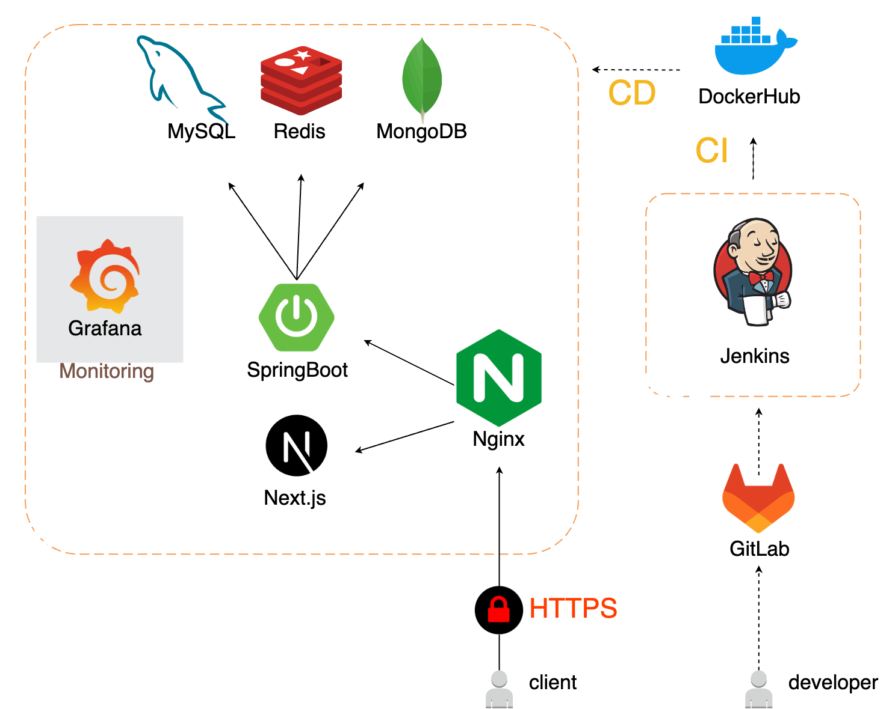

# 프로젝트 이름

프로젝트 설명을 간략하게 적어주세요. 이 프로젝트가 무엇을 하는지, 왜 유용한지 등에 대한 내용을 포함하세요.

## 목차

- [개발 기간](#개발-기간)
- [팀원](#팀원)
- [기술 스택](#기술-스택)
- [서비스 화면 예시](#서비스-화면-예시)
- [아키텍처 다이어그램](#아키텍처-다이어그램)
- [ERD](#erd)
- [디렉토리 구조](#디렉토리-구조)

## 개발 기간

2024.05.01 ~ 2024.05.21 (6주)

## 팀원

<table>
  <tr>
         <td align="center" width="16%">
            
             
            <a href="https://github.com/neongseoman">박근수</a>
        </td>
        <td align="center" width="16%">
            
             
            <a href="https://github.com/#">김다인</a>
        </td>
        <td align="center" width="16%">
            
             
            <a href="https://github.com/#">김신영</a>
        </td>
        <td align="center" width="16%">
            
             
            <a href="https://github.com/#">김지용</a>
        </td>
        <td align="center" width="16%">
            
             
            <a href="https://github.com/#">손지은</a>
        </td>
        <td align="center" width="16%">
            
             
            <a href="https://github.com/#">진창현</a>
        </td>
      <tr>
        <td align="center">    
          
<b>팀장, 백엔드</b>

          
비동기 스케줄링

          
OAuth 로그인

        </td>
        </td>
        <td align="center">
            
<b>백엔드, 인프라</b>

            
ㅁㄴㅇㄹ

            
ㅁㄴㅇㄹ

        </td>
        <td align="center">
            
<b>백엔드</b>

            
ㅁㄴㅇㄹ

            
ㅁㄴㅇㄹ

        </td>
        <td align="center">
            
<b>프론트엔드</b>

          
ㅁㄴㅇㄹ

        </td>
        <td align="center">
            
<b>프론트엔드</b>

          
ㅁㄴㅇㄹ

          
ㅁㄴㅇㄹ

        </td>
        <td align="center">
          
<b>프론트엔드</b>

          
ㅁㄴㅇㄹ

        </td>
      </tr>
  </tr>
</table>

## 기술 스택

### Front-end

### Back-end

### Infra

### 협업Tools

 

## 서비스 화면 예시

프로젝트의 주요 화면을 이미지로 첨부하고 각 화면에 대한 설명을 추가합니다.

### 메인 화면

**설명:**
메인 화면에서는 사용자가 서비스의 주요 기능에 접근할 수 있습니다. 상단 메뉴에서 다양한 섹션으로 이동할 수 있으며, 하단에는 최근 업데이트 내용이 표시됩니다.

**주요 기능:**

- 최신 뉴스 및 업데이트 보기
- 주요 메뉴로의 빠른 접근
- 사용자 맞춤형 콘텐츠 표시

**사용 예시:**

- 사용자는 로그인 후 메인 화면에서 최신 뉴스와 개인화된 추천 콘텐츠를 확인합니다.

### 사용자 프로필

**설명:**
사용자 프로필 화면에서는 사용자의 개인 정보와 활동 내역을 확인할 수 있습니다. 프로필 사진, 이름, 이메일 등이 표시되며, 사용자가 작성한 글이나 댓글도 함께 볼 수 있습니다.

**주요 기능:**

- 개인 정보 확인 및 수정
- 활동 내역 조회
- 프로필 사진 변경

**사용 예시:**

- 사용자는 프로필 화면에서 자신의 최근 활동을 검토하고, 필요 시 개인정보를 업데이트합니다.

### 설정 화면

**설명:**
설정 화면에서는 사용자가 서비스의 다양한 설정을 변경할 수 있습니다. 알림 설정, 개인정보 보호 설정, 계정 관리 등이 포함됩니다.

**주요 기능:**

- 알림 설정 조정
- 개인정보 보호 옵션 설정
- 계정 정보 관리

**사용 예시:**

- 사용자는 설정 화면에서 알림 빈도를 조절하고, 개인정보 보호 수준을 설정합니다.

## 아키텍처 다이어그램

## ERD

## 디렉토리 구조
